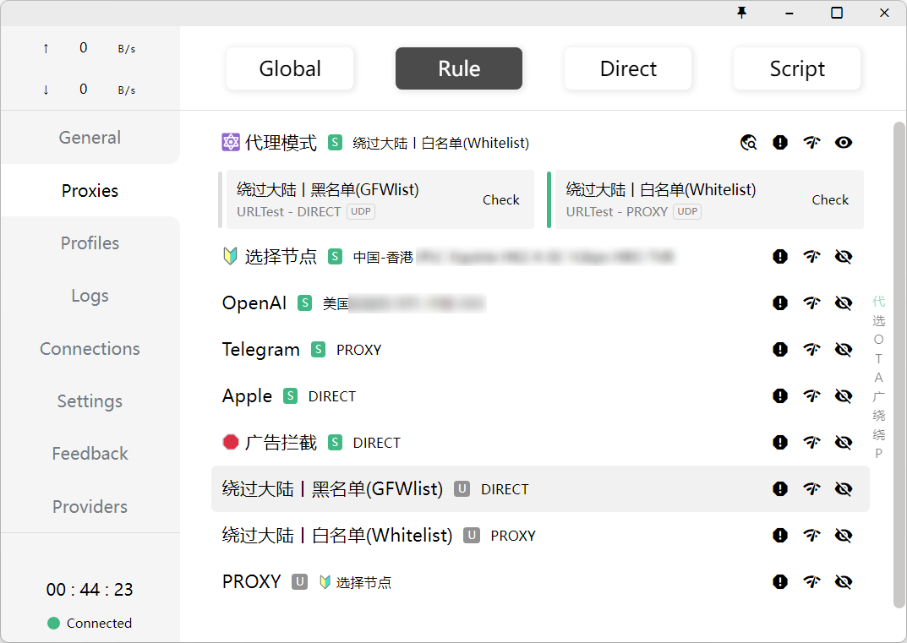

# clash_parsers
 `Clash for Windows`的parsers配置，为了更好的使用ChatGPT和NewBing。
## 设置方法
在`Clash for Windows`的Settings-Profiles-Parsers中粘贴['parsers.txt'](/parsers.txt)中的内容，然后更新订阅即可。

设置好的`Proxies`界面如下图所示

 
 **参考**：
 https://github.com/Fndroid/clash_for_windows_pkg/issues/2193
